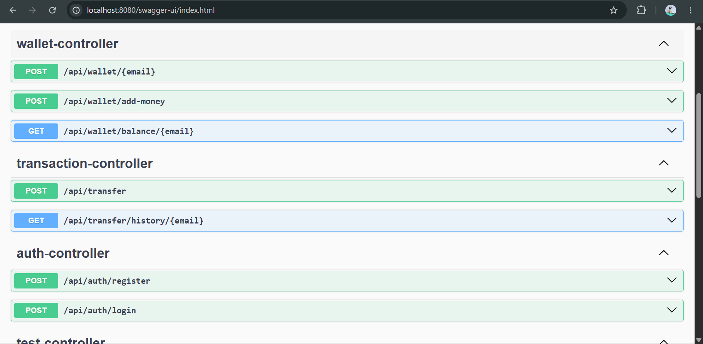
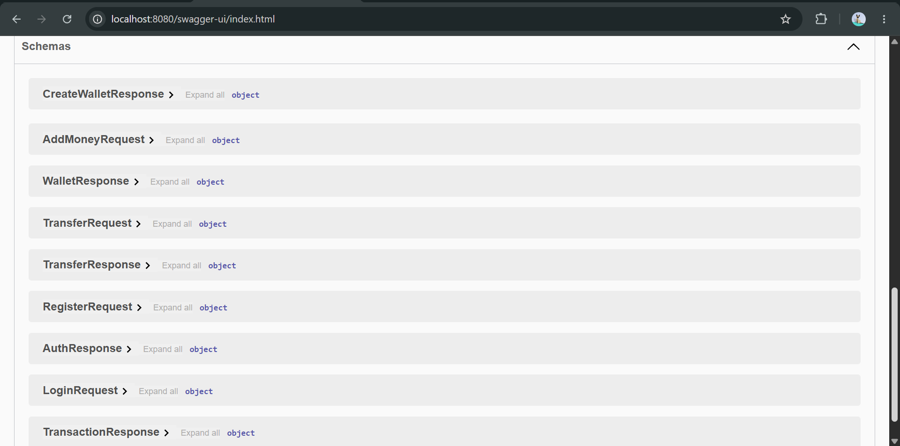
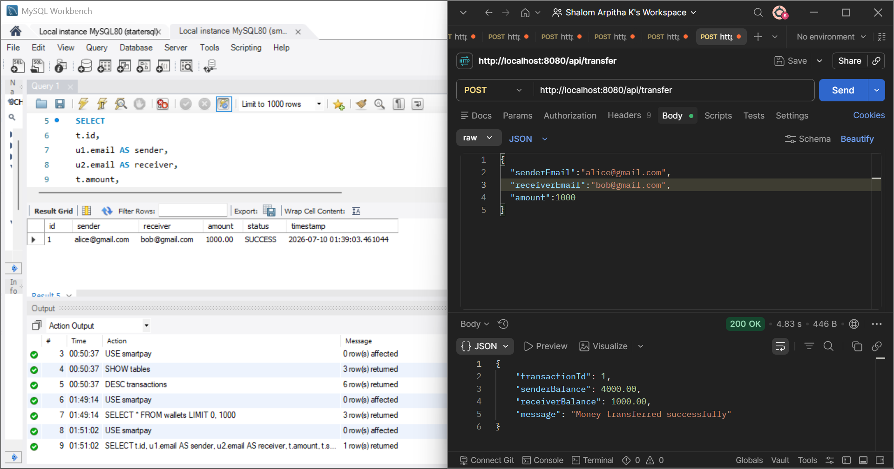
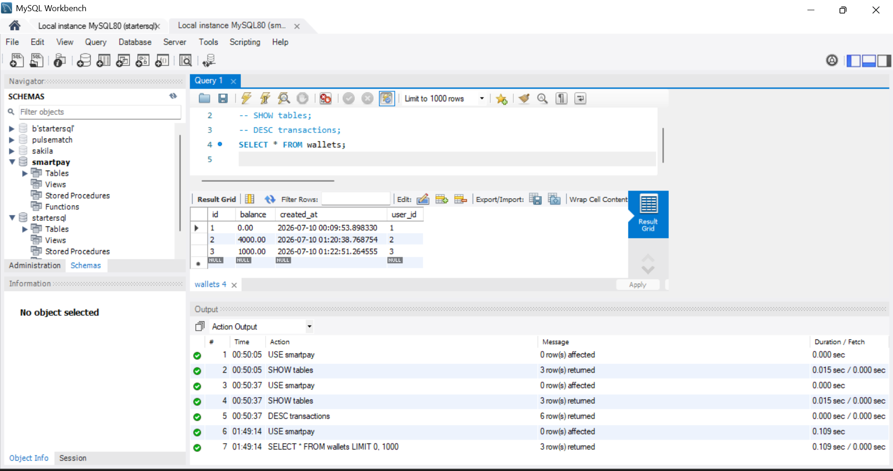
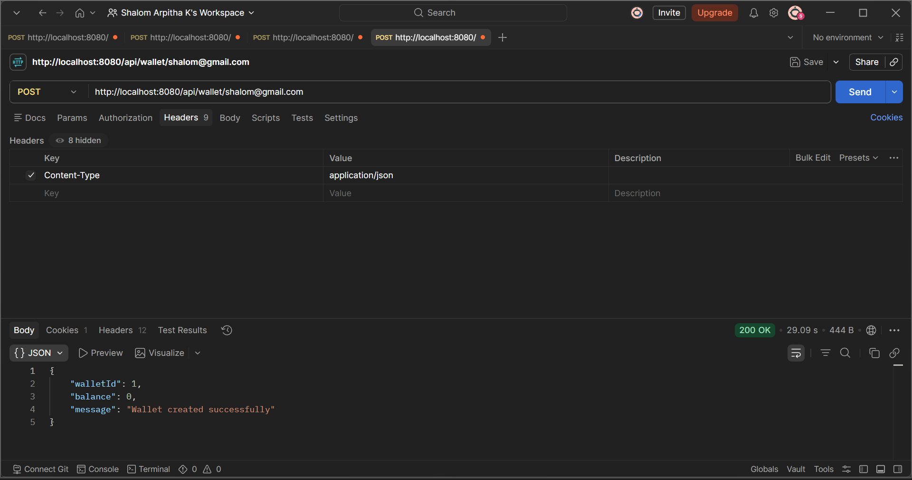
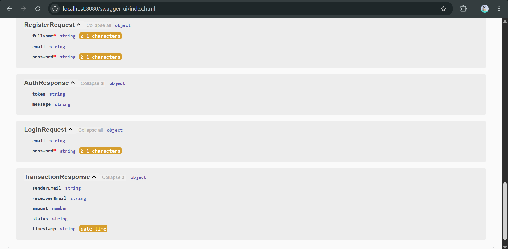
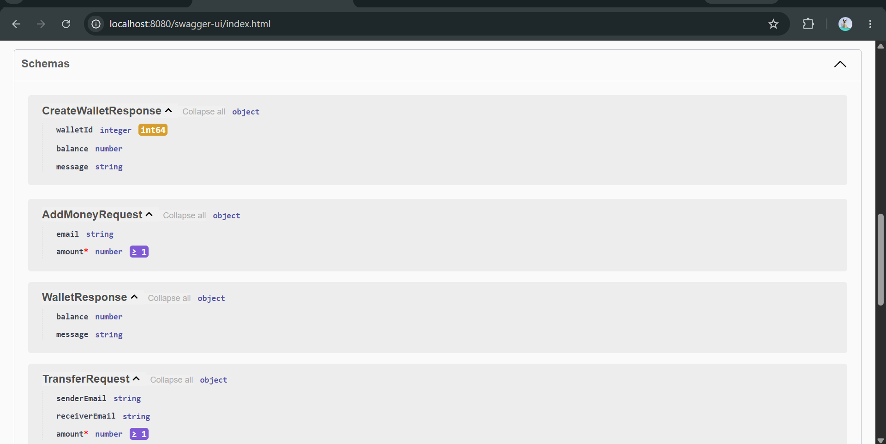

SmartPay — Distributed Digital Wallet Platform

SmartPay is a secure and scalable digital wallet backend platform built using Java and Spring Boot.

The project demonstrates backend engineering concepts including secure authentication, RESTful API design, database persistence, caching, and event-driven processing using Apache Kafka.

SmartPay allows users to securely manage digital wallets, perform wallet operations, and maintain transaction records while using modern backend technologies used in production-grade systems.

 Features

1) Authentication & Security
User registration and login
JWT-based authentication
Secure password storage using BCrypt encryption
Role-based API protection using Spring Security
Stateless authentication architecture

2) Digital Wallet Management
User wallet creation
Wallet balance management
Secure wallet operations
User-specific wallet access control

3) Transaction Management
Wallet transaction processing
Transaction history tracking
Persistent transaction storage
Database consistency using JPA and Hibernate

4) Event-Driven Processing with Kafka
Kafka-based asynchronous event processing
Transaction events published through Kafka producers
Event consumers process backend events independently
Reduces tight coupling between application components

5) Performance Optimization using Redis
Redis caching for frequently accessed data
Reduces repeated database queries
Improves response time for high-read operations

6) API Documentation & Testing
Interactive API documentation using Swagger/OpenAPI
REST API validation using Postman
Easy API exploration and testing

🛠️ Tech Stack
Backend
Java 21
Spring Boot
Spring Security
JWT Authentication
Spring Data JPA
Hibernate
Database
MySQL
Distributed System Components
Apache Kafka
Redis
Development Tools
Maven
Swagger UI
Postman
Git
VS Code

🏗️ System Architecture

SmartPay follows a layered backend architecture designed for maintainability, scalability, and separation of responsibilities.

The system is divided into multiple layers where each component has a specific responsibility.

1. Client Layer

The client layer represents applications interacting with SmartPay APIs.

Users send requests such as:

Registering an account
Logging in
Accessing wallet details
Performing wallet transactions
Viewing transaction history

Requests are sent through REST APIs exposed by the Spring Boot application.

2. Controller Layer

The Controller layer acts as the entry point of the application.

Responsibilities:

Handles incoming HTTP requests
Validates request data
Maps requests to appropriate services
Returns API responses

Example:

User sends a transaction request → Transaction Controller receives request → passes it to Service Layer.

3. Service Layer

The Service layer contains the core business logic of SmartPay.

Responsibilities:

Implements wallet operations
Handles transaction processing rules
Performs validations
Coordinates communication between database, Redis, and Kafka

This layer keeps business logic separate from API handling.

4. Repository Layer

The Repository layer manages communication with MySQL.

Using Spring Data JPA and Hibernate:

Entities are mapped to database tables
Database operations are performed through repositories
Transaction records and user information are persisted securely
5. MySQL Database Layer

MySQL acts as the primary persistent storage system.

Stores:

User information
Wallet details
Transaction records

Hibernate manages object-relational mapping between Java objects and database tables.

6. Redis Cache Layer

Redis is used as an in-memory caching layer.

Purpose:

Reduce repeated database queries
Improve API response time
Store frequently accessed information temporarily

Flow:

Request → Check Redis Cache → If available return cached data → Otherwise fetch from MySQL and update cache

7. Kafka Event Processing Layer

Apache Kafka enables asynchronous communication inside SmartPay.

Instead of processing every operation synchronously, important events can be published to Kafka topics.

Flow:

Transaction Request

↓

Transaction Service

↓

Kafka Producer publishes event

↓

Kafka Topic

↓

Kafka Consumer processes event

↓

Further actions such as notifications or fraud detection can be performed asynchronously

Benefits:

Loose coupling between components
Better scalability
Reliable event processing

Architecture Flow
                Client
                  |
                  |
                  v
          REST API Controllers
                  |
                  |
                  v
          Business Service Layer
                  |
        -----------------------
        |                     |
        v                     v
   MySQL Database        Redis Cache
        |
        |
        v
 Transaction Data

        |
        v

   Kafka Event Pipeline
        |
        |
        v
 Kafka Consumers
(Event Processing)

📸 Project Screenshots

1) Swagger API Documentation

Swagger UI provides interactive documentation for all SmartPay REST APIs.

2) Swagger Schemas 

3) Postman API Testing showing Transaction Successfull

REST endpoints were tested using Postman to validate authentication, wallet operations, and API responses. 

4) Database Structure of wallets

MySQL database tables demonstrate persistent storage design for users, wallets, and transactions.

5) Wallet Creation 

Postman validates the authenticity of wallet being created 

6) Users Registration & Authentication

Creates and authenticates a new SmartPay user account using email, password based and generates a JWT token for accessing secured API's

7) Add Money API and others

Allows users to add funds to their wallet , even transfers

⚙️ Running the Project Locally
Prerequisites

Install:

Java 21
Maven
MySQL
Redis
Apache Kafka
Clone Repository
git clone <shalom-ath>
Database Setup

Create database:

CREATE DATABASE smartpay;

Configure your database password using environment variables.

Example:

DB_PASSWORD=your_password
Start Application

Run:

mvn spring-boot:run

Application:

http://localhost:8080

Swagger:

http://localhost:8080/swagger-ui.html

🔮 Future Improvements
Kafka Streams based fraud detection
Payment gateway integration
API rate limiting
Docker containerization
Cloud deployment
Monitoring and logging using production observability tools

👩‍💻 Author

Shalom Arpitha

Backend Developer

Java | System Design | Distributed Systems | Backend Engineering